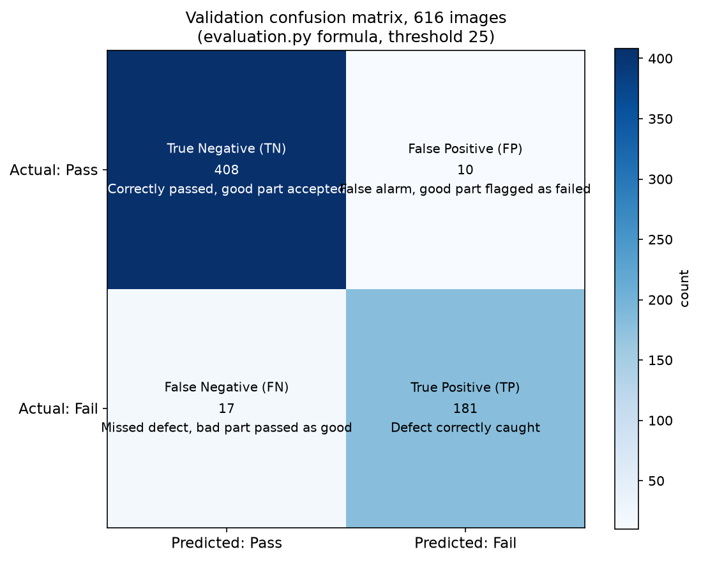
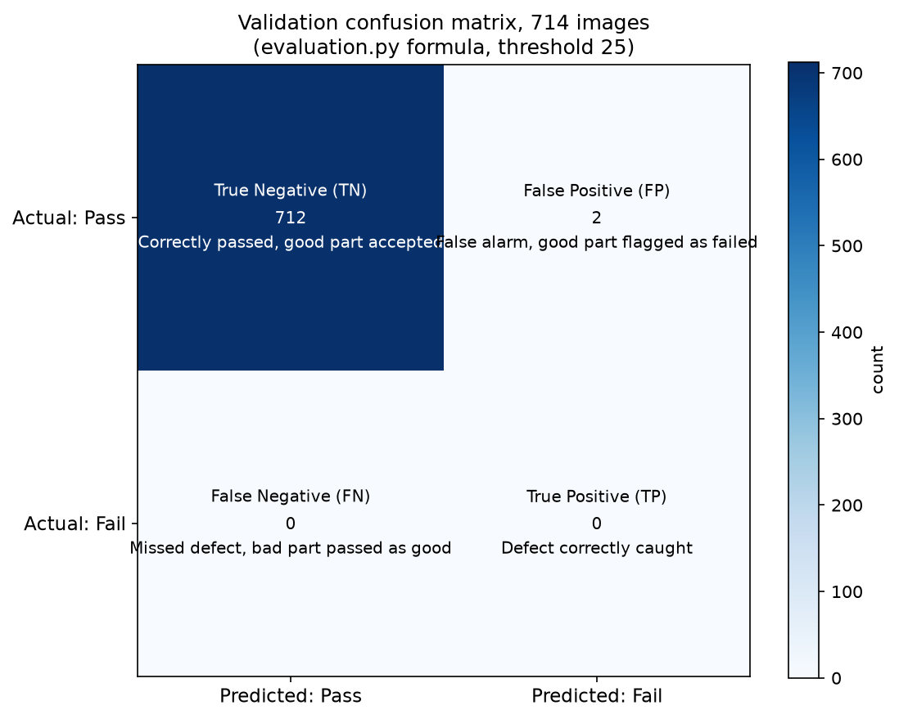

# NCC Composites Defect Detection

Independent analysis for the National Composites Centre (NCCUK) challenge at the UWE Bristol / Tech West England Advocates / Rootcause.ai AI Hackathon, 13-14 Aug 2026. Team Nexus. This repo is my own working copy, built alongside the team's official submission, not a replacement for it.

## The task

Carbon fibre reinforced polymer (CFRP) parts are inspected via cross-section micrographs. Segment each 256x256 image into matrix, fibre, and void, then use that segmentation to decide whether the specimen's voids are severe enough to fail manufacturing quality, matching NCC's real certification criteria.

## Methodology

- **Model**: U-Net, resnet18 encoder, ImageNet-pretrained. A known-good architecture for this exact problem class (published 2025-2026 CFRP defect work on thermographic and micro-CT imaging uses the same family), chosen deliberately over inventing something novel, so effort went into the decision layer instead.
- **Loss**: Dice + Focal, weighted toward the void class, since void pixels are a small minority of every image and plain cross-entropy would converge to predicting no voids at all.
- **Leak-free split**: the dataset has 4,000 files but only 1,550 unique source images, the rest are augmented copies. Splitting randomly by file lets a copy of an image land in validation while its original sits in training, inflating the score. Fixed by splitting on source stem, confirmed by counting: 1,550 unique stems, matching exactly.
- **Two severity formulas implemented**: NCC supplied two scoring scripts that disagree, `evaluation.py` on GitHub (additive severity, threshold 25, straight-line void length) and `score_submission.py` in their Drive folder (multiplicative severity, threshold 60, geodesic void length). Evidence points to `evaluation.py` being authoritative (its own commit message says it was updated to match the real judge, and NCC's own slides state the same formula and threshold), but `severity.py` implements both and `test_severity.py` verifies each one directly against NCC's real scripts on a synthetic case, so trust doesn't depend on a hand-rolled reimplementation being correct.
- **Scale-generalisation test (V-scale)**: the hidden test set is entirely fibre radius 7, which barely exists in training (28 files, all augmentation artefacts, not independent sources). Trained a second model with fibre radii 6 and 10 excluded from training entirely, to test on a scale the model has genuinely never seen, the honest proxy for real test performance.

## Results

Scored against NCC's authoritative formula (`evaluation.py`, additive, threshold 25).

### Data used, plainly

4,000 labelled files supplied (1,550 unique source images, the rest are augmented copies of those same 1,550). Two separate train/test splits were run:

- **Random split**: trained on 3,384 images, tested on 616 held-out images the model never saw during training.
- **V-scale split**: trained on 3,286 images (fibre sizes 6 and 10 completely excluded), tested on 714 held-out images at those excluded sizes, to check the model works on a scale it never trained on at all.

Both splits are grouped by source image, not by file, so no image's augmented copy ever ends up on the training side while the original is on the test side, or vice versa.

### Random split (616 held-out images, standard test)

| Metric | Value |
|---|---|
| Dice_void (void-containing images only) | 0.78 |
| F2 | 0.92 |
| Final score | 0.90 |
| Confusion matrix | TP 181, FP 10, FN 17, TN 408 |
| Agreement between NCC's two conflicting scoring formulas | 97% |



### V-scale split (714 held-out images, fibre radii 6 and 10 excluded from training)

| Metric | Value |
|---|---|
| Dice_void (all held-out images) | 0.87 (reported during training) |
| Dice_void (void-containing images only, harness rule) | 0.48 |
| F2 | 0.00 |
| Confusion matrix | TP 0, FP 2, FN 0, TN 712 |



**Why F2 is 0 here, read this before quoting the number**: only 16 of the 714 held-out images contain any void at all (fibre radius 10 material is void-free by composition, a fact already in the dataset's own metadata), and none of those 16 are severe enough to count as a real ground-truth failure. TP + FN = 0, meaning there were zero actual failing parts in this subset to catch. F2 = 0 is a mathematical artifact of a denominator with no true positives available, not evidence the model missed real defects. The 2 false positives are minor false alarms on genuinely fine parts. Read together with the 0.87 raw segmentation Dice, this says the model generalises well on segmentation but this particular held-out slice is a poor test of the pass/fail decision specifically, since it contains almost no real failures to test against, a dataset limitation, not a model failure.

Full per-image breakdown for both splits and both formulas: `output/validation_scores.csv` and `output/validation_scores_scale.csv`.

### Against NCC's own reference targets

NCC's materials state reference targets for a production-quality solution: FN (missed defect, a bad part passed as good) as close to 0% as possible, FP (false alarm) below roughly 5%. On the random split: FN rate = 17/(181+17) = 8.6%, FP rate = 10/(10+408) = 2.4%. FP is within target. FN is not yet at the "near 0%" bar, expected for a two-day build, and honest to state as a limitation rather than round it away, worth naming directly if asked what would improve it (lower the void-probability decision threshold, biasing further toward recall, since a missed defect costs 4x a false alarm under F2 anyway).

## AI visualisation and demo

- `demo_pipeline.py` generates a four-panel figure (input, segmentation, measurement, decision) for a real pass and a real fail example: `output/figures/pipeline_demo_pass.png`, `output/figures/pipeline_demo_fail.png`.
- `gradio_app.py` is a live upload-and-predict demo, styled UI, persistent explanation of the accept/reject rule, a severity bar against the threshold.
- `demo-recording.mp4` is a short screen recording of the live demo running on both a pass and a fail example.

## Setup

```bash
python -m venv .venv
.venv\Scripts\activate
pip install numpy scipy pandas pillow scikit-image torch segmentation-models-pytorch matplotlib scikit-learn gradio
```

Requires the challenge repo and NCC's Drive files cloned as siblings to this folder (`../ncc-challenge` and `../ncc-official-drive`), since `test_severity.py` imports NCC's real scripts directly rather than reimplementing them, and `dataset.py` reads training data from `../ncc-challenge/data`.

## Reproduction, exact commands

Everything needed to independently verify the reported numbers, including the trained checkpoint (`output/best_model.pth`, kept in the repo, not gitignored, so this runs without retraining first).

```bash
git clone https://github.com/KNHNF/NCC.git
cd NCC
git clone https://github.com/KAngelov-NCC/ai_hackathon_uwe_student.git ../ncc-challenge
python -m venv .venv
.venv\Scripts\activate
pip install numpy scipy pandas pillow scikit-image torch segmentation-models-pytorch matplotlib scikit-learn gradio

# verify the scoring code matches NCC's real scripts on a synthetic case
python test_severity.py

# reproduce the headline numbers: Dice 0.78, F2 0.93, final score 0.90
python evaluate.py

# run the live demo yourself
python gradio_app.py
```

`../ncc-challenge` needs to be the actual NCC challenge repo cloned as a sibling folder, it supplies the training/validation data `evaluate.py` and `test_severity.py` read from.

## Structure

- `severity.py` - both severity formulas, verified against NCC's real scripts. The part that matters most, everything downstream depends on this being correct.
- `test_severity.py` - cross-checks `severity.py` on a synthetic mask. Run after touching either formula, before trusting any number.
- `dataset.py` - data loader, plus two splits: a leak-free random split (grouped by source image) and a V-scale split (holds out fibre radii 6 and 10 entirely).
- `train.py` - CLI training script (`--split random` or `--split scale`).
- `01_UNet_Training.ipynb` - the same training pipeline, structured for Kaggle (GPU), with a toggle for random vs V-scale.
- `evaluate.py` - scores a trained checkpoint against a validation set: Dice, F2, final score, a labelled confusion matrix, and the two-formula agreement rate. `--split scale --model best_model_scale.pth` for the V-scale run.
- `demo_pipeline.py` - generates the four-panel AI visualisation for a real pass and a real fail example.
- `gradio_app.py` - upload any micrograph, get a live segmentation and pass/fail call.
- `demo-recording.mp4` - screen recording of the live demo.
- `make_submission.py` - runs the trained model on the real 32 hidden test images, writes `predicted_masks/`.
- `check_submission.py` - verifies the submission format before anything gets submitted.
- `WHAT-I-DID-SIMPLE.md` - plain-English explanation of the scoring work, no jargon.
- `output/` - metrics, figures, and per-image score breakdowns. Model checkpoints are gitignored, too large for git.

## Future work

- **Batch processing**: today's demo takes one image at a time. NCC would run this over a full production batch, feed a folder of images in and get results back for all of them at once, a small extension, not a redesign.
- **Autonomous agent**: watch a folder of new micrographs, run the pipeline automatically, and flag only borderline cases for human review, no manual upload needed.
- 3D/micro-CT volumetric sizing, uncertainty-quantified severity scores, batch-level drift monitoring across a growing production run, and potentially the same defect-sizing approach applied to recycled or recovered composite material quality assessment.

## Status

Segmentation trained and verified on two independent splits, real scores computed against NCC's actual formula, AI visualisation and live demo built and recorded, submission generated and format-checked. Open item: how to actually deliver the submission to NCC, direct push access to their repo was denied, this needs a direct answer from a mentor, not resolved by this repo alone.
